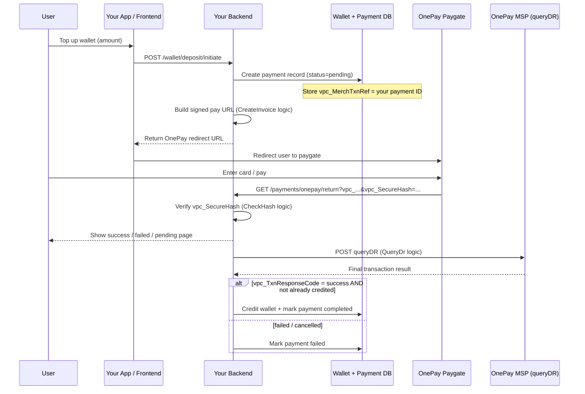

# OnePay Payment Gateway — JavaScript Sample

Node.js sample code for integrating with the [OnePay](https://onepay.vn) payment gateway (VPC/MSP APIs). The project demonstrates how to create payment invoices, handle tokenized payments, query installment plans, verify secure hashes, and look up transaction status against the **MTF (test)** environment.

## Overview

This is a sandbox / reference implementation, not a production web server. Each script builds signed OnePay request parameters, sends HTTPS requests to the gateway, and logs responses to the console.

Supported flows:


| Flow                      | Module                                    | Description                                            |
| ------------------------- | ----------------------------------------- | ------------------------------------------------------ |
| Standard payment          | `CreateInvoice.js`                        | Create a payment invoice and redirect to OnePay        |
| Token creation            | `CreateInvoiceToken.js`                   | Pay and save a card token for future use               |
| Token payment             | `CreateInvoiceToken.js`                   | Pay using a previously saved token                     |
| Installment (OnePay UI)   | `CreateInvoiceInstallment.js`             | Installment payment with plan selection on OnePay site |
| Installment (merchant UI) | `CreateInvoiceInstallment.js`             | Installment with pre-selected bank, term, and fee      |
| Installment lookup        | `CreateInvoiceInstallment.js`             | Query available installment plans for an amount        |
| Transaction query         | `QueryDr.js`                              | Query transaction result by merchant reference         |
| Secure hash verify        | `CheckHash.js` / `VerifyVpcSecureHash.js` | Validate `vpc_SecureHash` on callback URLs             |


## Requirements

- Node.js (v14+ recommended)
- npm

## Installation

```bash
npm install
```

### Dependencies


| Package     | Purpose                                                              |
| ----------- | -------------------------------------------------------------------- |
| `crypto-js` | HMAC-SHA256 / HMAC-SHA512 signing for OnePay secure hashes           |
| `axios`     | HTTP client (used in `Util.js` and `CheckHash.js`)                   |
| `express`   | Listed in `package.json` but **not used** by any project source file |


Built-in Node.js modules used: `https`, `process`.

## Project Structure

```
javascript/
├── Main.js                    # Entry point — orchestrates sample operations
├── Config.js                  # Merchant credentials and gateway URLs
├── Util.js                    # Shared crypto, HTTP, and signing utilities
├── CreateInvoice.js           # Standard invoice creation
├── CreateInvoiceToken.js      # Token create / token pay flows
├── CreateInvoiceInstallment.js # Installment payment and plan lookup
├── QueryDr.js                 # Transaction status query (queryDR)
├── CheckHash.js               # Standalone secure-hash demo (self-executing)
├── VerifyVpcSecureHash.js     # Secure-hash verification (currently empty)
├── package.json
└── README.md
```

## Configuration

Merchant credentials and environment settings live in `Config.js`:


| Constant                           | Description                                   |
| ---------------------------------- | --------------------------------------------- |
| `MERCHANT_PAYNOW_ID`               | Pay-now merchant ID                           |
| `MERCHANT_PAYNOW_ACCESS_CODE`      | Pay-now access code                           |
| `MERCHANT_PAYNOW_HASH_CODE`        | Pay-now HMAC secret (hex)                     |
| `MERCHANT_INSTALLMENT_ID`          | Installment merchant ID                       |
| `MERCHANT_INSTALLMENT_ACCESS_CODE` | Installment access code                       |
| `MERCHANT_INSTALLMENT_HASH_CODE`   | Installment HMAC secret (hex)                 |
| `BASE_URL`                         | Gateway base URL (`https://mtf.onepay.vn`)    |
| `URL_PREFIX`                       | Payment redirect path (`/paygate/vpcpay.op?`) |
| `HOST`                             | Host header value for MSP API calls           |


> **Note:** Credentials in `Config.js` are test/sandbox values. Do not commit production secrets.

## Secure Hash Algorithm

All VPC payment and query requests use the same signing process (implemented in `Util.js`):

1. **Sort** request parameters alphabetically by key (`sortObj`).
2. **Build string to hash** — include only keys prefixed with `vpc_` or `user_`, excluding `vpc_SecureHash` and `vpc_SecureHashType`, and skip empty values (`generateStringToHash`).
3. **Sign** with HMAC-SHA256 using the merchant hash code parsed as hex (`genSecureHash`).
4. **Append** the uppercase hex digest as `vpc_SecureHash`.

Example string format:

```
vpc_AccessCode=...&vpc_Amount=...&vpc_Command=pay&...
```

Installment plan lookup (`getInstallment`) uses a separate **HTTP Signature** scheme (`createRequestSignatureITA`) with HMAC-SHA512 over selected headers.

## Module Reference

### `Util.js`

Shared utilities exported for use across modules:

- `sortObj(obj)` — sort object keys alphabetically
- `generateStringToHash(paramSorted)` — build the VPC hash input string
- `genSecureHash(stringToHash, merHashCode)` — HMAC-SHA256 sign and return uppercase hex
- `sendHttpsGet(url)` — GET request; logs redirect `Location` header and body
- `sendHttpsPost(url, params)` — POST `application/x-www-form-urlencoded` to MSP API
- `sendHttpsGetWithHeader(url, headersRequest)` — GET with custom headers (installment API)
- `createRequestSignatureITA(...)` — HTTP Signature header for installment endpoints

### `CreateInvoice.js`

`createInvoice(merchantId, merchantAccessCode, merchantHashCode)`

Builds a standard `vpc_Command=pay` request with a unique `vpc_MerchTxnRef` (`TEST_<timestamp>`), signs it, and sends a GET to the paygate URL.

Default test amount: `1000000000` VND (smallest currency unit).

### `CreateInvoiceToken.js`

- `createInvoiceAndCreateToken(...)` — adds `vpc_CreateToken=true` to save a card token during payment.
- `createInvoiceAndPaymentWithToken(..., tokenNum, tokenExp)` — pays using `vpc_TokenNum` and `vpc_TokenExp`.

### `CreateInvoiceInstallment.js`

- `createInvoiceInstallment(...)` — installment invoice; amount must be ≥ 3,000,000 VND.
- `createInvoiceInstallmentThemIta(..., amount, cardList, itaTime, itaFeeAmount, itaBank)` — merchant-side installment with pre-selected plan (`vpc_Theme=ita`, `vpc_ItaTime`, `vpc_ItaBank`, etc.).
- `getInstallment(amount, merchantId, merchantHashCode)` — GET `/msp/api/v1/merchants/{id}/installments?amount=...` with HTTP Signature auth.

### `QueryDr.js`

`queryApiDr(merchantId, merchantAccessCode, merchantHashCode, merchTxnRef)`

Sends a `vpc_Command=queryDR` POST to:

```
POST https://mtf.onepay.vn/msp/api/v1/vpc/invoices/queries
```

Includes hardcoded query credentials (`vpc_User`, `vpc_Password`) for the test environment.

### `CheckHash.js`

Standalone script that verifies a callback URL's `vpc_SecureHash`. Contains duplicate implementations of the hash helpers (also present in `Util.js`). **Runs automatically** when executed directly (`runMain2()` is called at load time).

### `VerifyVpcSecureHash.js`

Referenced by `Main.js` for `verirySign()`, but the file is currently **empty**. Hash verification logic exists in `CheckHash.js` as `onePayVerifySecureHash()`.

## Running the Samples

### Main entry point

Edit `Main.js` to call the desired function, then run:

```bash
node Main.js
```

By default, `main()` calls `verirySign()` which requires a working `VerifyVpcSecureHash.js`.

Available functions in `Main.js`:


| Function                                 | What it does                               |
| ---------------------------------------- | ------------------------------------------ |
| `makeInvoice()`                          | Standard payment (PayNow merchant)         |
| `makeInvoiceAndCreateToken()`            | Payment + token creation                   |
| `makeInvoiceAndPaymentWithToken()`       | Pay with saved token                       |
| `makeInvoiceInstallmentAtOnePaySite()`   | Installment — plan chosen on OnePay        |
| `makeInvoiceInstallmentAtMerchantSite()` | Installment — plan chosen on merchant site |
| `getInstallmentByMerchantId()`           | Fetch installment options for an amount    |
| `queryTransaction()`                     | Query a transaction by `vpc_MerchTxnRef`   |
| `verirySign()`                           | Verify secure hash on a callback URL       |


Example — switch to invoice creation:

```javascript
function main() {
  makeInvoice();
}
```

### Run individual modules

```bash
node CreateInvoice.js      # not wired — export only; use via Main.js
node CheckHash.js            # runs hash verification demo immediately
```

## API Endpoints Used


| Endpoint                                  | Method | Used by                       |
| ----------------------------------------- | ------ | ----------------------------- |
| `/paygate/vpcpay.op`                      | GET    | Invoice / payment redirects   |
| `/msp/api/v1/vpc/invoices/queries`        | POST   | `QueryDr.js`                  |
| `/msp/api/v1/merchants/{id}/installments` | GET    | `CreateInvoiceInstallment.js` |


Environment: **MTF test** — `https://mtf.onepay.vn`

## Common VPC Parameters


| Parameter         | Description                                  |
| ----------------- | -------------------------------------------- |
| `vpc_Version`     | Protocol version (`2`)                       |
| `vpc_Command`     | `pay` or `queryDR`                           |
| `vpc_Merchant`    | Merchant ID                                  |
| `vpc_AccessCode`  | Merchant access code                         |
| `vpc_MerchTxnRef` | Unique transaction reference                 |
| `vpc_Amount`      | Amount in smallest currency unit (VND × 100) |
| `vpc_OrderInfo`   | Order description                            |
| `vpc_ReturnURL`   | Merchant callback URL after payment          |
| `vpc_SecureHash`  | HMAC-SHA256 signature                        |


## Wallet Integration Flow

This section describes how to integrate OnePay with a **digital wallet** system where successful payments credit a user's wallet balance. For a wallet top-up, you typically only need the **standard pay** flow (`CreateInvoice.js`), **hash verification** (`CheckHash.js`), and **queryDR** (`QueryDr.js`).

### How OnePay redirect works

```
Your Website              OnePay Hosted Page              Bank
┌──────────┐              ┌──────────────────┐         ┌──────────┐
│ Customer │ ─ redirect ─ │ OnePay collects  │ ─ pays ─│ Processes│
│ clicks   │              │ card/bank details│         │ payment  │
│ "Pay Now"│ ─ redirect ─ │ on THEIR server  │─ result─│          │
└──────────┘              └──────────────────┘         └──────────┘
```

1. Customer clicks **Pay** on your site.
2. You redirect them to `https://mtf.onepay.vn/paygate/vpcpay.op?...` (the signed URL this repo builds).
3. OnePay shows their payment page — card entry, bank selection, 3D Secure, etc.
4. OnePay processes the payment with the bank.
5. OnePay redirects the user's browser back to your `vpc_ReturnURL` with the result and `vpc_SecureHash`.

### OnePay external endpoints

| OnePay touchpoint | Method | URL | Role |
| ----------------- | ------ | --- | ---- |
| Paygate (start payment) | GET redirect | `https://mtf.onepay.vn/paygate/vpcpay.op?...` | Send the user here to pay |
| Return URL (browser callback) | GET redirect to your URL | Your `vpc_ReturnURL` | User lands here after pay/cancel; show result UI |
| Query DR (server confirmation) | POST | `https://mtf.onepay.vn/msp/api/v1/vpc/invoices/queries` | Authoritative check before crediting wallet |

### End-to-end sequence



### Endpoints you should build

These are **your** system endpoints — OnePay does not replace them.

#### 1. Initiate deposit

**Suggested:** `POST /api/wallet/deposits` or `POST /api/payments/onepay/initiate`

1. Authenticate the user.
2. Validate amount (min/max, currency VND).
3. Create a **pending payment/deposit record**:
   - `user_id`, `amount`, `status = pending`, `provider = onepay`
   - **`merch_txn_ref`** — becomes `vpc_MerchTxnRef` (must be unique per attempt)
4. Build the OnePay request (same fields as `CreateInvoice.js`):
   - `vpc_Command = pay`
   - `vpc_MerchTxnRef` = your internal payment ID
   - `vpc_Amount` = amount in smallest unit (e.g. 100,000 VND → `10000000`)
   - `vpc_ReturnURL` = your callback URL (HTTPS in production)
   - `vpc_OrderInfo` = e.g. `Wallet top-up {paymentId}`
   - `vpc_Customer_Id` = your user ID
5. Sign with HMAC-SHA256 and append `vpc_SecureHash`.
6. Return `{ redirectUrl: "https://mtf.onepay.vn/paygate/vpcpay.op?..." }` to the frontend.

The frontend redirects the browser to that URL.

#### 2. Return URL handler

**Suggested:** `GET /api/payments/onepay/return`

Set this as `vpc_ReturnURL` when creating the invoice.

OnePay sends back (query string):

| Parameter | Purpose |
| --------- | ------- |
| `vpc_MerchTxnRef` | Your payment ID |
| `vpc_Amount` | Paid amount (smallest unit) |
| `vpc_TxnResponseCode` | `0` = success (typical OnePay convention) |
| `vpc_Message` | Human-readable result |
| `vpc_TransactionNo` | OnePay transaction ID |
| `vpc_SecureHash` | Signature — must verify |

Steps:

1. Parse all query params.
2. **Verify `vpc_SecureHash`** (same logic as `onePayVerifySecureHash` in `CheckHash.js`). If invalid, do not credit the wallet.
3. Load the pending payment by `vpc_MerchTxnRef`.
4. Show a success/failure/pending page to the user.

> **Important:** Treat this as **UX only**, not the sole source of truth. The user can close the tab before returning. Wallet credit should be driven by queryDR (step 3 below).

#### 3. Confirm payment (queryDR)

**Suggested:** internal service call (not necessarily a public endpoint)

Call this right after return URL verification, via a background job, or when the user clicks "Check status".

```
POST https://mtf.onepay.vn/msp/api/v1/vpc/invoices/queries
Content-Type: application/x-www-form-urlencoded

vpc_Command=queryDR
vpc_MerchTxnRef={your payment ref}
vpc_Merchant, vpc_AccessCode, vpc_User, vpc_Password, vpc_Version, vpc_SecureHash
```

On response:

1. Verify the response hash if OnePay signs it.
2. If success and amount matches your pending record → **credit wallet** (idempotent) and set `status = completed`.
3. If failed/cancelled → set `status = failed`.
4. If unknown → keep `pending` and retry queryDR later.

This step should **trigger wallet credit**, not the browser redirect alone.

#### 4. Payment status (optional)

**Suggested:** `GET /api/wallet/deposits/:id` or `GET /api/payments/:merchTxnRef`

Lets the app poll after return, or recover if the user closed the browser.

### Connecting to your wallet pipeline

If DB records are pipelined into the wallet on successful payment:

```
payments (wallet_deposits)          wallet_ledger (pipeline source)
──────────────────────────          ─────────────────────────────────
id                                  entry_id
user_id                             user_id
amount                              amount (+)
merch_txn_ref                       reference = payment.id
status: pending → completed         type: deposit
onepay_transaction_no               created_at
```

Credit the wallet only when:

1. `queryDR` confirms success, **and**
2. `vpc_Amount` matches the pending record, **and**
3. Payment is not already `completed` (idempotency).

Your pipeline can listen for `payments.status = completed`, or insert the ledger row in the same DB transaction as the status update.

### Sample repo mapping

| Sample file | Your responsibility |
| ----------- | ------------------- |
| `CreateInvoice.js` | Initiate deposit — build signed paygate URL |
| `CheckHash.js` | Return URL handler — verify callback signature |
| `QueryDr.js` | Confirm payment — server-side status before wallet credit |
| `Config.js` | Merchant ID, access code, hash code, base URL |
| `CreateInvoiceToken.js` | Only if you want saved cards for repeat top-ups |
| `CreateInvoiceInstallment.js` | Only if wallet top-up supports installment |

### Critical rules

1. **`vpc_MerchTxnRef` must be yours** — map it 1:1 to a pending deposit row before redirect.
2. **Never credit on redirect alone** — always confirm with `queryDR`.
3. **Idempotency** — the same `merch_txn_ref` must not credit the wallet twice.
4. **Amount validation** — compare OnePay amount (smallest unit) with your stored amount before credit.
5. **Hash verification** — on every callback and ideally on queryDR response.
6. **Pending expiry** — expire stale `pending` records after N hours.
7. **Reconciliation job** — cron to queryDR all `pending` payments older than X minutes.

### Minimal integration checklist

| Step | Owner | Action |
| ---- | ----- | ------ |
| 1 | Your backend | Create pending deposit + unique `merch_txn_ref` |
| 2 | Your backend | Sign params → redirect URL to OnePay paygate |
| 3 | User | Pays on OnePay |
| 4 | Your backend | Handle `GET /payments/onepay/return`, verify hash, show UI |
| 5 | Your backend | `POST queryDR` to OnePay MSP |
| 6 | Your backend | On confirmed success → credit wallet / emit to pipeline |
| 7 | Your backend | Optional cron for stuck `pending` payments |

### What to skip for v1

- **Token payments** (`CreateInvoiceToken.js`) — unless repeat top-up without re-entering card
- **Installment** (`CreateInvoiceInstallment.js`) — unless wallet top-up via installment
- **`CheckHash.js` as a standalone script** — you only need the verify logic inside your return handler

Environment variables for all configurable values are documented in `.env.example`.

For mock testing, QA scenarios, and validation without live OnePay payments, see [TESTING.md](./TESTING.md).

## Known Issues

1. **`VerifyVpcSecureHash.js` is empty** — `Main.js` imports `onePayVerifySecureHash` from this file, but it has no implementation. Copy or refactor from `CheckHash.js` to fix `verirySign()`.
2. **`CheckHash.js` auto-executes** — calling `node CheckHash.js` immediately runs `runMain2()`; it is not import-safe.
3. **Duplicate hash logic** — `CheckHash.js` reimplements helpers that already exist in `Util.js`.
4. **Unused dependency** — `express` is installed but unused.
5. **Unused import in `Util.js`** — `const { config } = require("process")` is imported but never used.
6. **Hardcoded test values** — IP (`vpc_TicketNo`), customer info, query credentials, and token numbers are embedded in source.

## License

ISC (per `package.json`).
