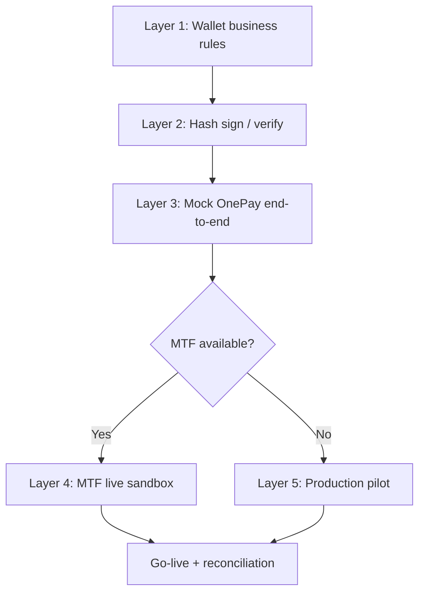
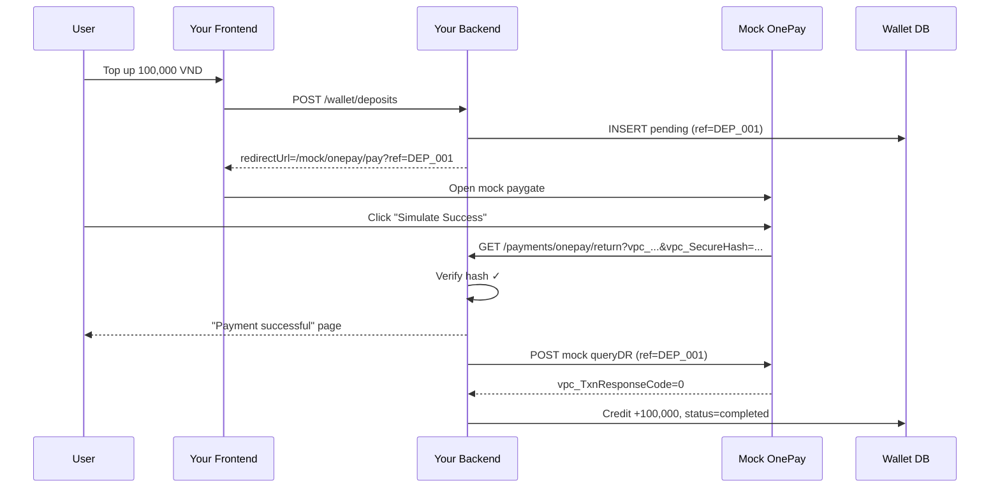

# OnePay + Wallet — Testing & Mock Flow Guide

How to validate your wallet integration with OnePay **without relying on live production payments**. Use this guide during development, QA, and pre-go-live sign-off.

Related docs:

- [README.md](./README.md) — sample repo overview and wallet integration flow
- [.env.example](./.env.example) — configurable credentials and defaults

---

## Why mock testing?

OnePay integrations involve three moving parts:

1. **Your wallet system** — pending deposits, ledger, balance updates
2. **Browser redirect flow** — user leaves your app and returns via `vpc_ReturnURL`
3. **Server confirmation** — `queryDR` to OnePay MSP

You can break production or double-credit a wallet if you only test against real money. Mock testing lets you prove wallet rules, hash handling, and state transitions **before** OnePay is available or before MTF credentials are issued.

### Environments at a glance

| Environment | URL | When to use |
| ----------- | --- | ----------- |
| **Mock OnePay** | Your internal stub | Day-to-day dev & automated tests |
| **MTF (sandbox)** | `https://mtf.onepay.vn` | OnePay UAT when credentials are available |
| **Production** | OnePay production URL | Soft launch with minimum amounts only |

> This repo defaults to **MTF**. If your merchant account has no MTF access, use the mock flow below for most validation and request MTF/UAT credentials from OnePay.

---

## Testing layers

Validate in order. Do not skip to live payments until lower layers pass.



| Layer | Needs OnePay? | What it proves |
| ----- | ------------- | -------------- |
| 1 — Wallet rules | No | Balance changes, idempotency, status transitions |
| 2 — Hash crypto | No | Signature generation and tamper detection |
| 3 — Mock flow | No | Full initiate → callback → confirm → credit path |
| 4 — MTF | Yes (sandbox) | Real OnePay pages, cards, queryDR |
| 5 — Production pilot | Yes (real money) | Final smoke test at minimum amount |

---

## Mock architecture

Replace OnePay with an internal **Mock Payment Gateway** during development.

```
┌─────────────┐     ┌──────────────┐     ┌─────────────────┐     ┌─────────────┐
│  Your App   │────▶│ Your Backend │────▶│ Mock OnePay UI  │────▶│ Your Return │
│  (frontend) │     │  (wallet API)│     │ (internal page) │     │ URL handler │
└─────────────┘     └──────────────┘     └─────────────────┘     └─────────────┘
                            │                                              │
                            │         ┌─────────────────┐                  │
                            └────────▶│ Mock queryDR    │◀─────────────────┘
                                      │ (internal API)  │
                                      └─────────────────┘
                                            │
                                            ▼
                                      ┌─────────────┐
                                      │ Wallet DB   │
                                      │ + pipeline  │
                                      └─────────────┘
```

### Components to stand up (conceptual)

| Component | Replaces | Purpose |
| --------- | -------- | ------- |
| Mock paygate page | `https://mtf.onepay.vn/paygate/vpcpay.op` | Shows fake "Pay / Fail / Cancel" buttons |
| Mock return redirect | OnePay browser callback | Builds signed query string → your `vpc_ReturnURL` |
| Mock queryDR API | `POST .../vpc/invoices/queries` | Returns success/fail/pending for a `vpc_MerchTxnRef` |
| Feature flag | — | `PAYMENT_PROVIDER=mock` vs `onepay` in dev/staging |

---

## Mock end-to-end flow

### Step 1 — Initiate deposit (your API)

**Request:** `POST /api/wallet/deposits` with `{ "amount": 100000 }`

**Expected:**

| Check | Pass criteria |
| ----- | ------------- |
| Auth | Unauthenticated request rejected |
| Amount validation | Below min / above max rejected |
| DB row created | `status = pending`, wallet balance unchanged |
| Reference generated | Unique `merch_txn_ref` stored |
| Redirect URL returned | Points to mock paygate when `PAYMENT_PROVIDER=mock` |

**Do not** credit the wallet at this step.

---

### Step 2 — Mock paygate (user action)

User lands on internal page, e.g. `/mock/onepay/pay?ref=DEP_123`.

Page displays:

- Amount
- `merch_txn_ref`
- Buttons: **Simulate Success** | **Simulate Failure** | **Simulate Cancel**

Each button triggers a redirect to your real return URL handler with appropriately signed params (see [Sample callback payloads](#sample-callback-payloads)).

---

### Step 3 — Return URL handler (your API)

**Request:** `GET /api/payments/onepay/return?vpc_MerchTxnRef=...&vpc_SecureHash=...`

**Expected:**

| Check | Pass criteria |
| ----- | ------------- |
| Hash valid | Accept; invalid hash → 400, no wallet change |
| Payment found | Load pending row by `vpc_MerchTxnRef` |
| UX response | Success / failed / cancelled page shown |
| Wallet | **Still not credited** (or only marked `processing`) |

---

### Step 4 — Confirm via mock queryDR (your backend)

After return URL handling, your backend calls mock queryDR (or real queryDR in MTF).

**Expected for success:**

| Check | Pass criteria |
| ----- | ------------- |
| queryDR success | `vpc_TxnResponseCode = 0` |
| Amount match | OnePay amount equals pending record |
| Idempotent credit | Wallet +amount **once** |
| Status | Payment → `completed` |
| Pipeline | Ledger entry emitted / inserted |

**Expected for failure/cancel:**

| Check | Pass criteria |
| ----- | ------------- |
| Status | Payment → `failed` or `cancelled` |
| Wallet | Balance unchanged |

---

### Step 5 — Status poll (optional)

**Request:** `GET /api/wallet/deposits/:id`

Use when user closed browser before return URL loaded. Mock queryDR should still resolve the payment.

---

## Full mock sequence diagram



---

## Test scenarios matrix

Run every scenario in mock mode before MTF or production.

| # | Scenario | Trigger | Expected payment status | Expected wallet |
| - | -------- | ------- | ----------------------- | --------------- |
| 1 | Happy path | Success on mock paygate + queryDR success | `completed` | +amount once |
| 2 | User cancels | Cancel on mock paygate | `cancelled` or `failed` | No change |
| 3 | Payment declined | Fail on mock paygate | `failed` | No change |
| 4 | Duplicate return URL | Same success callback twice | `completed` | +amount once only |
| 5 | Duplicate queryDR | queryDR success called twice | `completed` | +amount once only |
| 6 | Return success, queryDR pending | Return OK, queryDR not ready | `pending` / `processing` | No change yet |
| 7 | Return success, queryDR fail | Mismatch: return says OK, queryDR fails | `failed` | No change |
| 8 | Tampered hash | Invalid `vpc_SecureHash` | unchanged | No change |
| 9 | Unknown ref | Callback for unknown `vpc_MerchTxnRef` | — | No change, log error |
| 10 | Amount mismatch | Callback amount ≠ pending amount | `failed` | No change |
| 11 | User abandons | No return URL, queryDR success later | `completed` | +amount once |
| 12 | User abandons | No return URL, queryDR never succeeds | `pending` → expire | No change |
| 13 | Expired pending | Pending older than TTL | `expired` | No change |
| 14 | Reconciliation job | Cron queryDR on stuck pending | resolves 7, 11, 12 | Per queryDR result |

---

## Sample callback payloads

Use these as **documentation fixtures** for mock redirects and hash tests. Values are illustrative — generate real `vpc_SecureHash` with your merchant hash code using the same algorithm as `Util.js` / `CheckHash.js`.

### Success callback (query string params)

| Parameter | Example value |
| --------- | ------------- |
| `vpc_Command` | `pay` |
| `vpc_MerchTxnRef` | `DEP_20240601120000_001` |
| `vpc_Merchant` | `{your merchant id}` |
| `vpc_Amount` | `10000000` |
| `vpc_TxnResponseCode` | `0` |
| `vpc_Message` | `Approved` |
| `vpc_TransactionNo` | `MOCK-TXN-10001` |
| `vpc_OrderInfo` | `Wallet top-up DEP_001` |
| `vpc_SecureHash` | `{computed HMAC-SHA256}` |

### Failed callback

| Parameter | Example value |
| --------- | ------------- |
| `vpc_TxnResponseCode` | `1` (or non-zero per OnePay docs) |
| `vpc_Message` | `Declined` |

### Cancelled callback

| Parameter | Example value |
| --------- | ------------- |
| `vpc_TxnResponseCode` | `99` |
| `vpc_Message` | `Canceled` |

> Reference: `CheckHash.js` includes a real cancelled callback URL with `vpc_TxnResponseCode=99` for hash verification practice.

---

## Layer 2 — Hash verification tests

No network required. Reference implementation: `Util.js`, `CheckHash.js`.

| # | Test | Input | Expected |
| - | ---- | ----- | -------- |
| H1 | Sign payment request | Known param set + hash code | Matches expected `vpc_SecureHash` |
| H2 | Verify valid callback | Known OnePay sample URL | Verification passes |
| H3 | Tamper amount | Change `vpc_Amount` in URL, keep old hash | Verification fails |
| H4 | Tamper ref | Change `vpc_MerchTxnRef`, keep old hash | Verification fails |
| H5 | Exclude secure hash field | Hash string must omit `vpc_SecureHash` | Signing consistent |
| H6 | Empty param omitted | Param with empty value excluded from hash | Signing consistent |
| H7 | Param sort order | Keys sorted alphabetically before hash | Signing consistent |

---

## Layer 1 — Wallet state machine

Payment record states your system should enforce:

```
                    ┌──────────┐
         initiate   │ pending  │
        ──────────▶ │          │
                    └────┬─────┘
                         │
           ┌─────────────┼─────────────┐
           ▼             ▼             ▼
     ┌──────────┐ ┌──────────┐ ┌──────────┐
     │ completed│ │  failed  │ │ expired  │
     └──────────┘ └──────────┘ └──────────┘
           │
           └──▶ wallet credited (once)
```

**Rules to test without OnePay:**

- Only `pending` → `completed` may trigger wallet credit
- `completed` is terminal (no re-credit)
- `failed`, `cancelled`, `expired` never credit
- Concurrent workers processing same ref → one winner only

---

## Mock queryDR responses

When your backend POSTs to mock queryDR, return one of:

### Success

```
vpc_TxnResponseCode=0
vpc_Message=Approved
vpc_MerchTxnRef={ref}
vpc_Amount={amount}
vpc_TransactionNo=MOCK-TXN-10001
```

### Not found / still processing

```
vpc_TxnResponseCode={non-zero}
vpc_Message=Transaction not found
```

### Failed

```
vpc_TxnResponseCode=1
vpc_Message=Declined
```

Your backend should treat **queryDR success + amount match** as the wallet credit trigger, not the mock return URL alone.

---

## MTF validation (when available)

Once OnePay enables MTF on your account:

| Step | Action | Verify |
| ---- | ------ | ------ |
| 1 | Initiate deposit via your API | Redirect opens `mtf.onepay.vn` paygate |
| 2 | Pay with OnePay test card/bank | OnePay docs / support provide test instruments |
| 3 | Return URL fires | Hash verifies, UI correct |
| 4 | queryDR | Success code, amount matches |
| 5 | Wallet | Single credit |
| 6 | Repeat payment same ref | Idempotency holds |

Use repo samples as reference:

| File | MTF test |
| ---- | -------- |
| `CreateInvoice.js` | Build and open paygate URL |
| `CheckHash.js` | Verify callback signatures |
| `QueryDr.js` | Server-side transaction lookup |

---

## Production pilot (no MTF fallback)

If only production credentials exist:

| Rule | Detail |
| ---- | ------ |
| Amount | Minimum allowed top-up only |
| Users | Internal staff accounts first |
| Monitoring | Manual review of every transaction for first N payments |
| Reconciliation | Daily cron: all `pending` + sample of `completed` vs queryDR |
| Rollback plan | Manual wallet adjustment process documented |

---

## Manual QA checklist

### Before merge (mock)

- [ ] All 14 scenarios in [test matrix](#test-scenarios-matrix) pass
- [ ] Hash tests H1–H7 pass
- [ ] Duplicate callback does not double-credit
- [ ] Duplicate queryDR does not double-credit
- [ ] Invalid hash rejected
- [ ] Amount mismatch rejected
- [ ] Abandoned payment stays pending until queryDR or expiry
- [ ] Logs include `merch_txn_ref`, status transitions, OnePay response codes

### Before go-live (MTF or pilot)

- [ ] Real paygate redirect works
- [ ] Return URL reachable from public internet (HTTPS)
- [ ] queryDR credentials work
- [ ] End-to-end success credits wallet once
- [ ] Failed payment does not credit wallet
- [ ] Reconciliation job runs and resolves stuck pendings

---

## Mapping mock steps to your endpoints

| Mock step | Your endpoint | Sample repo reference |
| --------- | ------------- | --------------------- |
| Initiate | `POST /api/wallet/deposits` | `CreateInvoice.js` |
| Return | `GET /api/payments/onepay/return` | `CheckHash.js` |
| Confirm | Internal queryDR call | `QueryDr.js` |
| Poll | `GET /api/wallet/deposits/:id` | — |
| Reconcile | Cron / worker | `QueryDr.js` pattern |

---

## Troubleshooting

| Symptom | Likely cause | Check |
| ------- | ------------ | ----- |
| Hash always fails | Wrong hash code, param order, or encoding | Compare with `CheckHash.js` string-to-hash output |
| Wallet credited twice | Missing idempotency guard | Unique constraint on credit per `merch_txn_ref` |
| Payment stuck pending | Return URL never hit, queryDR not called | Reconciliation job, status poll endpoint |
| Amount wrong | Smallest-unit conversion | 100,000 VND → `10000000` |
| Mock works, MTF fails | Different merchant credentials per env | Separate `.env` for MTF vs mock |

---

## Recommended test order for new developers

1. Read [Wallet Integration Flow](./README.md#wallet-integration-flow) in README
2. Run hash verification mentally / via `CheckHash.js` samples (Layer 2)
3. Walk through [mock end-to-end flow](#mock-end-to-end-flow) on paper
4. Implement or use mock paygate + mock queryDR (Layer 3)
5. Execute full [test scenarios matrix](#test-scenarios-matrix)
6. Request MTF credentials from OnePay → Layer 4
7. Production soft launch → Layer 5
